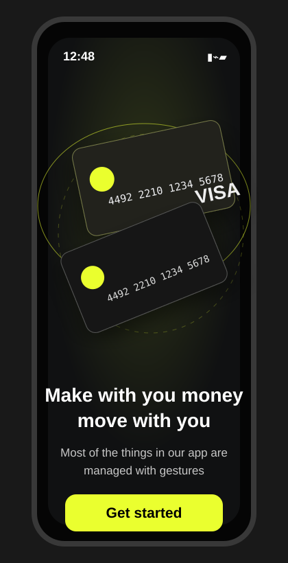
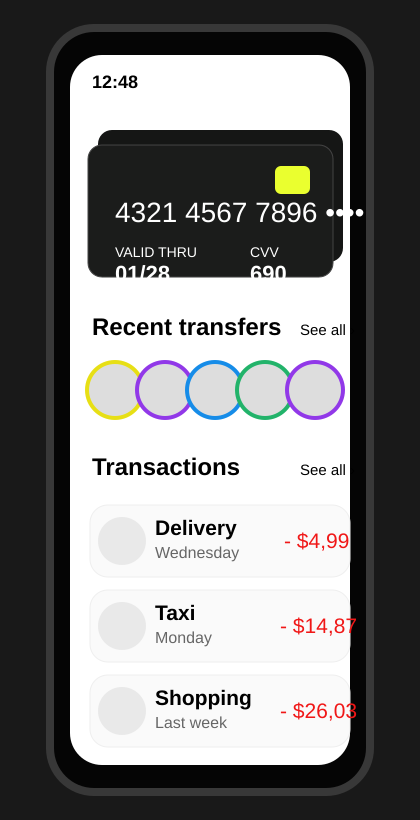
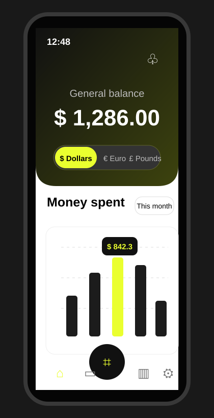
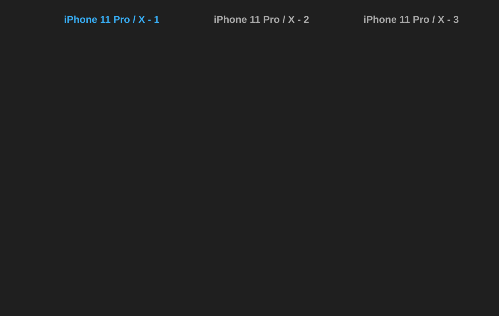

# برومبتات موك أب واجهات BankApp

استخدم البرومبتات التالية داخل ChatGPT أو أي أداة توليد صور/تصميم لعرض شكل الواجهات الثلاث. البرومبتات مكتوبة لتوليد موك أب واضح وقابل للمراجعة البصرية.

## صور الموك أب الجاهزة

> الصور التالية مضافة للمعاينة داخل ملف Markdown، ويمكن استخدامها كمرجع بصري سريع لشكل الواجهات.

### صفحة البداية Onboarding


### صفحة النشاط والمعاملات Activity


### صفحة لوحة الرصيد Dashboard


### عرض الصفحات الثلاث معًا


## 1) برومبت صفحة البداية Onboarding

```text
أنشئ موك أب احترافي عالي الجودة لتطبيق بنكي على شاشة iPhone 11 Pro / X لصفحة البداية Onboarding فقط.

المتطلبات البصرية:
- شاشة هاتف واحدة في المنتصف بنسبة iPhone 11 Pro / X.
- خلفية داكنة فاخرة بتدرج أسود/رمادي مع لمسة زيتونية خفيفة.
- في أعلى الشاشة شريط حالة iPhone بسيط يظهر الوقت 12:48 وأيقونات الشبكة والبطارية.
- أضف بطاقتين بنكيتين عائمتين ومتداخلتين في الجزء العلوي/الأوسط، بزاوية دوران خفيفة، لون البطاقات أسود/رمادي داكن، مع chip دائري بلون أصفر ليموني.
- أضف عناصر زخرفية خفيفة مثل دوائر/مدارات رفيعة ونجوم صغيرة.
- في أسفل منتصف الشاشة أضف عنوانًا كبيرًا بالإنجليزية:
  Make with you money
  move with you
- أسفل العنوان أضف نصًا صغيرًا:
  Most of the things in our app are
  managed with gestures
- أضف زرًا رئيسيًا في الأسفل بلون أصفر ليموني مكتوب عليه Get started.
- أضف مؤشر iPhone السفلي الأبيض.

أسلوب التصميم:
- Minimal, premium fintech, modern mobile banking UI.
- High contrast, rounded corners, soft shadows, realistic mockup.
- اجعل التصميم قريبًا من Figma mobile app presentation.
- لا تضف صفحات أخرى، فقط صفحة Onboarding.
```

## 2) برومبت صفحة لوحة الرصيد Dashboard

```text
أنشئ موك أب احترافي عالي الجودة لتطبيق بنكي على شاشة iPhone 11 Pro / X لصفحة Dashboard فقط.

المتطلبات البصرية:
- شاشة هاتف واحدة في المنتصف بنسبة iPhone 11 Pro / X وخلفية خارجية داكنة.
- أعلى الشاشة لوحة داكنة كبيرة بحواف سفلية مستديرة جدًا، بتدرج أسود/زيتوني.
- شريط حالة iPhone بالأعلى يظهر الوقت 12:48.
- أضف أيقونة إشعارات دائرية في أعلى يمين اللوحة.
- في منتصف اللوحة أضف نصًا صغيرًا General balance ثم رقم الرصيد كبيرًا:
  $ 1,286.00
- أسفل الرصيد أضف شريط اختيار عملة مستدير يحتوي:
  $ Dollars, € Euro, £ Pounds
  واجعل $ Dollars هو الخيار النشط بلون أصفر ليموني.
- أسفل اللوحة على خلفية بيضاء أضف عنوان Money spent وزر صغير This month.
- أضف رسمًا بيانيًا عموديًا بسيطًا بأعمدة سوداء وظلال رمادية، مع عمود نشط بلون أصفر ليموني، وفقاعة tooltip مكتوب فيها $ 842.3.
- أضف في أسفل الشاشة شريط تنقل بخمس أيقونات: home, card, scan في زر دائري أسود في المنتصف، analytics, settings.
- أضف مؤشر iPhone السفلي الأسود.

أسلوب التصميم:
- Premium fintech dashboard, clean mobile UI, Figma style, soft shadows.
- استخدم اللون الأصفر الليموني ك accent أساسي.
- لا تضف صفحات أخرى، فقط صفحة Dashboard.
```

## 3) برومبت صفحة النشاط والمعاملات Activity

```text
أنشئ موك أب احترافي عالي الجودة لتطبيق بنكي على شاشة iPhone 11 Pro / X لصفحة Activity / Transactions فقط.

المتطلبات البصرية:
- شاشة هاتف واحدة في المنتصف بنسبة iPhone 11 Pro / X وخلفية خارجية داكنة.
- خلفية الشاشة الداخلية بيضاء ونظيفة.
- شريط حالة iPhone بالأعلى باللون الأسود يظهر الوقت 12:48.
- في أعلى الشاشة أضف بطاقة بنكية عريضة داكنة بحواف مستديرة وظلال، مع طبقتين ظل خلف البطاقة لإحساس stack.
- داخل البطاقة أضف رقمًا مقسمًا:
  4321   4567   7896   ••••
- أضف معلومات Valid thru 01/28 و CVV 690 داخل البطاقة.
- أضف chip أصفر ليموني أعلى يمين البطاقة وبعض نجوم/زخارف صغيرة.
- أسفل البطاقة أضف عنوان Recent transfers.
- أضف صف صور دائرية صغيرة لأشخاص، مع حدود ملونة حول الصور.
- أسفل ذلك أضف عنوان Transactions.
- أضف قائمة معاملات بثلاثة عناصر:
  1. Delivery — Wednesday — - $4,99
  2. Taxi — Monday — - $14,87
  3. Shopping — Last week — - $26,03
- اجعل مبالغ المعاملات باللون الأحمر، والأيقونات داخل دوائر رمادية فاتحة.
- أضف مؤشر iPhone السفلي الأسود.

أسلوب التصميم:
- Minimal white fintech activity screen, premium banking UI, soft shadows, modern rounded cards.
- لا تضف صفحات أخرى، فقط صفحة Activity / Transactions.
```

## 4) برومبت موك أب كامل للصفحات الثلاث معًا

```text
أنشئ موك أب عرض احترافي يحتوي ثلاث شاشات iPhone 11 Pro / X جنبًا إلى جنب على خلفية داكنة، لعرض واجهات تطبيق بنكي باسم BankApp.

التخطيط العام:
- خلفية خارجية داكنة #1f1f1f.
- ثلاث شاشات iPhone 11 Pro / X مرتبة أفقيًا من اليسار إلى اليمين.
- فوق كل شاشة أضف عنوانًا صغيرًا:
  iPhone 11 Pro / X - 1
  iPhone 11 Pro / X - 2
  iPhone 11 Pro / X - 3
- اجعل الشاشة الأولى بعنوان أزرق فاتح، والعناوين الأخرى رمادية.
- استخدم نفس هوية التصميم في الشاشات الثلاث: أسود/رمادي داكن، أبيض، وأصفر ليموني ك accent.

الشاشة الأولى: Onboarding
- خلفية داكنة بتدرجات فاخرة.
- بطاقتان بنكيتان عائمتان ومتداخلتان.
- زخارف مدارية ونجوم صغيرة.
- العنوان:
  Make with you money
  move with you
- النص:
  Most of the things in our app are
  managed with gestures
- زر أصفر ليموني Get started.

الشاشة الثانية: Dashboard
- لوحة علوية داكنة بحواف سفلية مستديرة.
- General balance و الرصيد $ 1,286.00.
- شريط عملات مستدير: $ Dollars نشط، € Euro، £ Pounds.
- قسم Money spent مع زر This month.
- رسم بياني عمودي مع tooltip $ 842.3 وعمود أصفر ليموني.
- شريط تنقل سفلي بخمس أيقونات وزر scan دائري أسود في المنتصف.

الشاشة الثالثة: Activity / Transactions
- خلفية بيضاء.
- بطاقة بنكية داكنة في الأعلى مع ظل طبقات.
- رقم البطاقة 4321 4567 7896 ••••.
- Recent transfers مع صور أشخاص دائرية.
- Transactions بثلاثة عناصر: Delivery, Taxi, Shopping مع مبالغ حمراء.

أسلوب التصميم المطلوب:
- High fidelity UI mockup, premium fintech mobile app, Figma presentation style.
- Clean spacing, rounded corners, realistic shadows, crisp typography.
- اجعل النتيجة مناسبة للعرض على العميل أو لفريق التصميم.
```

## ملاحظات للاستخدام
- إذا أردت صورة واحدة لكل صفحة، استخدم البرومبتات 1 إلى 3 بشكل منفصل.
- إذا أردت صورة عرض واحدة تجمع كل الواجهات، استخدم البرومبت 4.
- يمكن إضافة عبارة: `generate as 4K image, high fidelity, no watermark` في نهاية أي برومبت عند استخدام أدوات توليد الصور.
